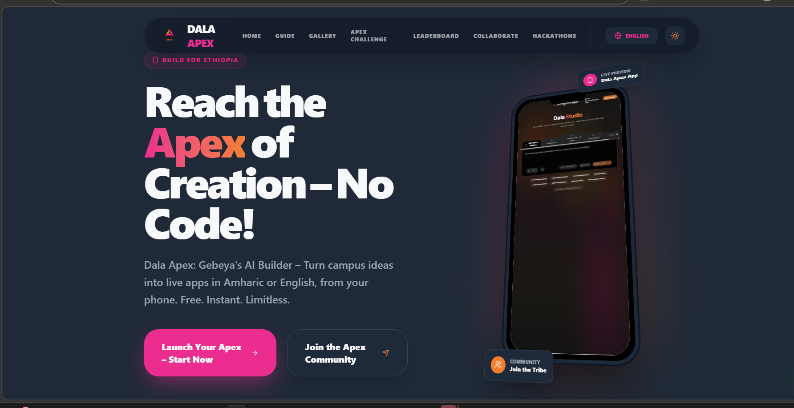

# Dala Apex

Dala Apex is a dynamic engagement platform I built using Dala Studio to promote its AI no-code builder on Ethiopian campuses. It features a guided user journey with challenges, leaderboards, idea boards, hackathons, and an integrated AI assistant to spark discovery, hands-on building, and community collaboration among students. This initiative drives adoption and innovation, aligning directly with the Dala Studio Professional Ambassador Program's focus on nurturing AI ecosystems through events and showcases.

